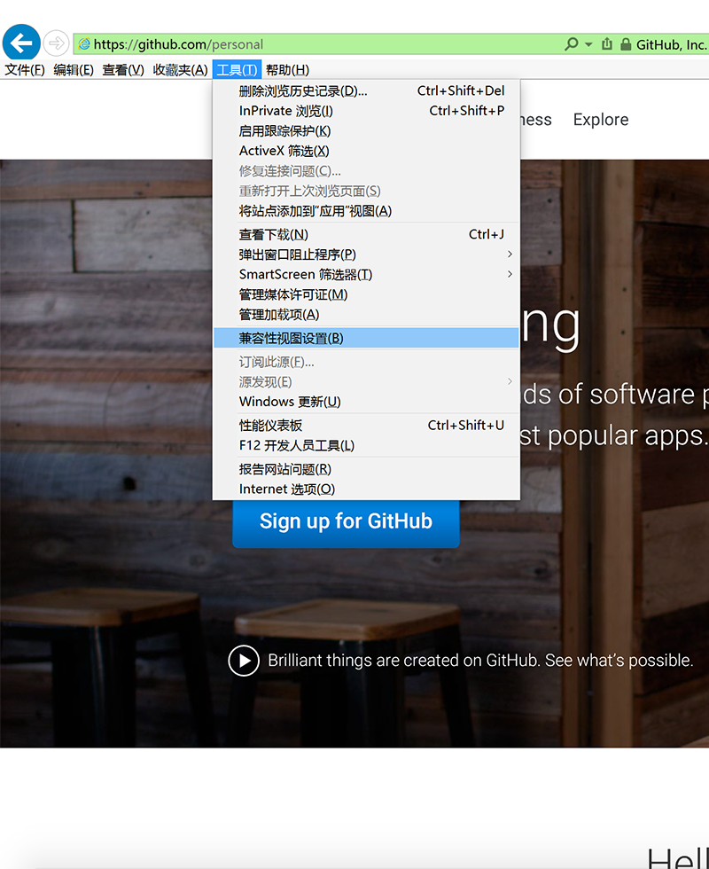
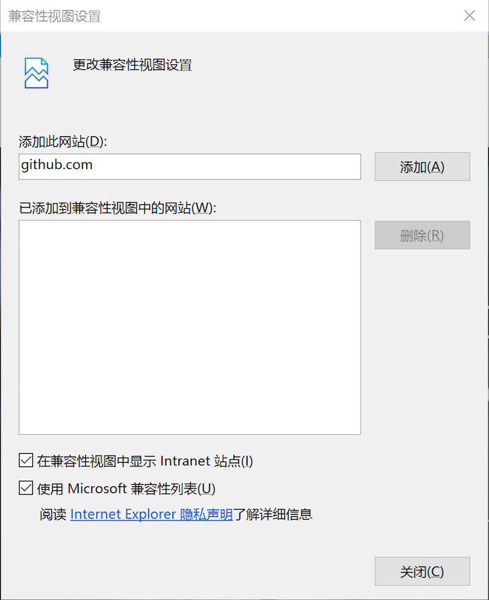
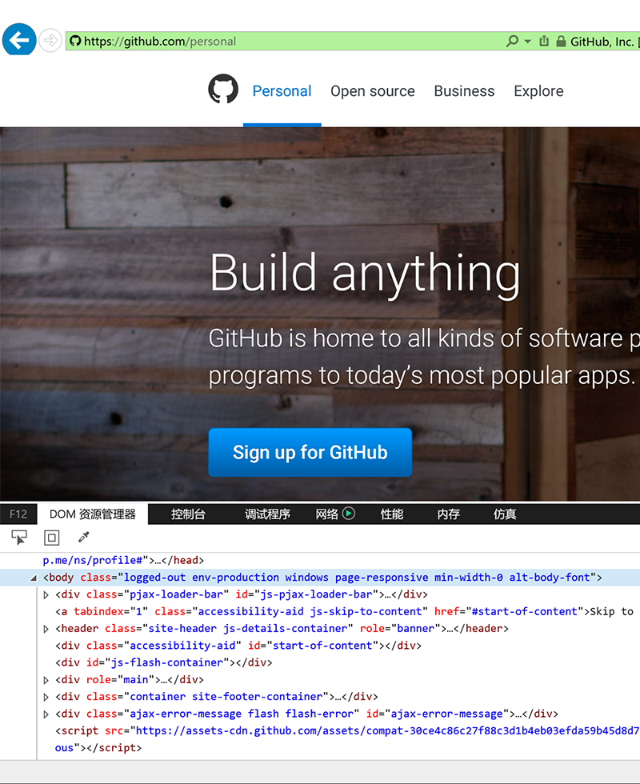
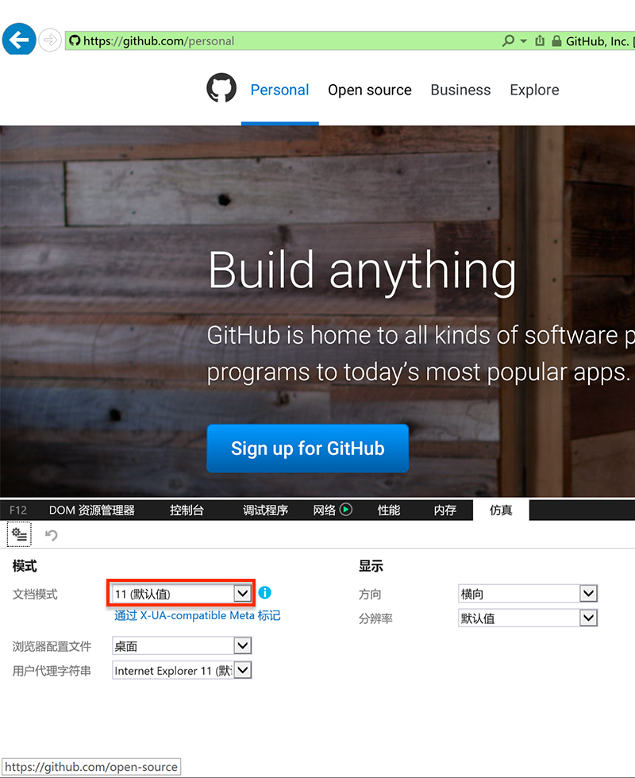
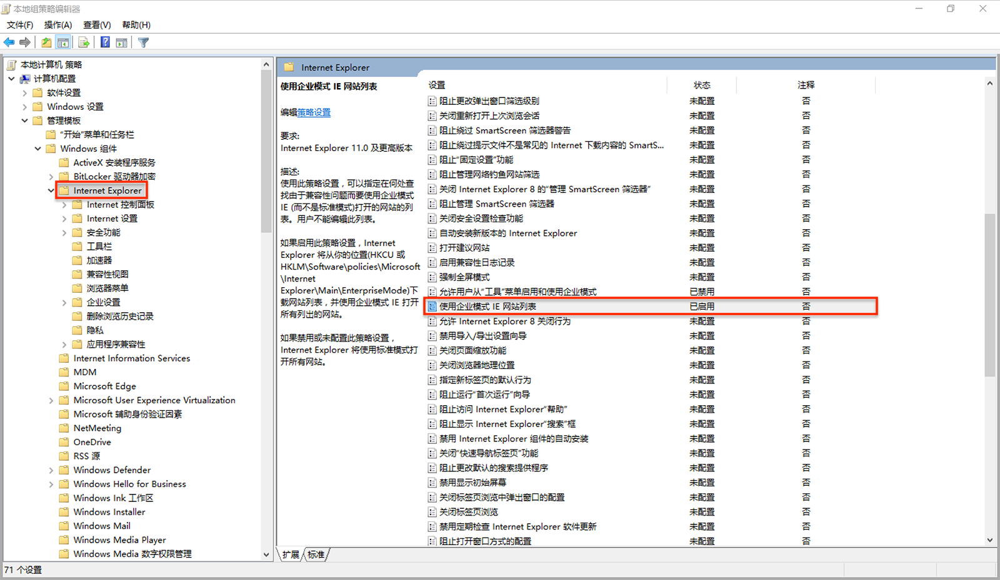
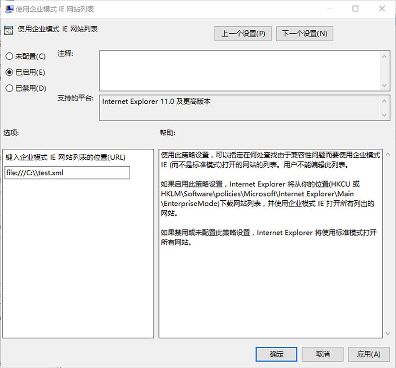
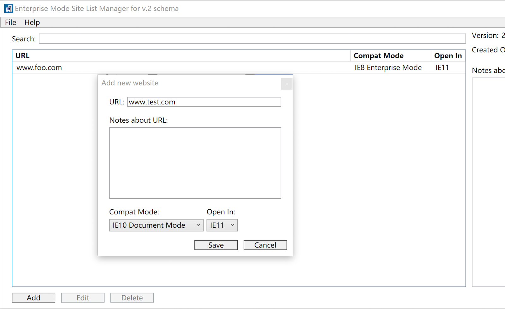
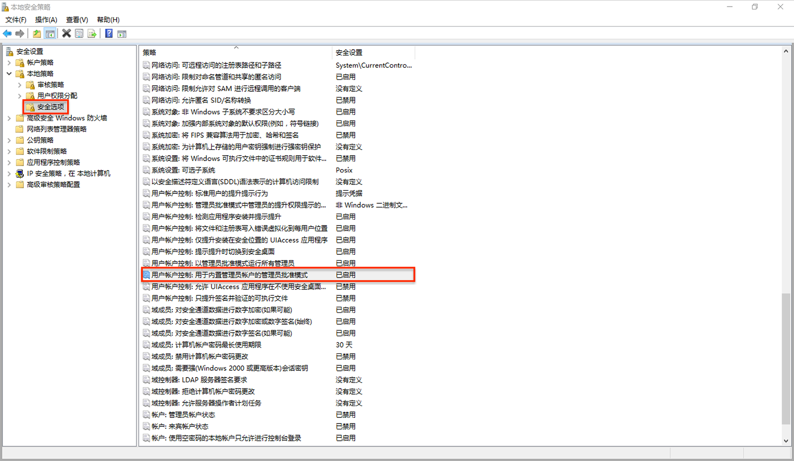

Internet Explorer Compatibilities
================================================
No matter if you are a web developer, or just a user, you have to deal with the
compatibility issues of variant browsers, from time to time.

Among all the browsers, Internet Explorer (IE for short) is the most complicated
one to deal with. We are not going to explain the reasons here, however, I bet
you already knew what I am talking about.

Fortunately, the IE developers have been awared of the issues and they have been
improving it in each release. Now, quite a few features can be used on IE to
provide better user exprience in regards with compatibilities.

When speaking of the compatibility of a browser, we are actually talking about
two things: 1) the compatibility with the W3C standards; or 2) the
compatibilities between releases;

In this tutorial, we will discuss the latter for IE11 on Windows 10, which is
the latest release at the time of documentation.

Compatibility View
--------------------------------------------------------
The Compatibility View feature was introduced since IE8 to help users deal with
page rendering issues. This feature allows the browser to render web pages as it
did in IE7.

This is useful when the website does not support IE8+. By default, IE11 renders
the following websites in Compatability View: 
1. All intranet websites
2. Websites in users' website list (an editable local list).
3. Websites in microsoft website List (a remote list maintained by Microsoft).

To open the Compatibility View: 

1. Press <kbd>alt</kbd>+<kbd>T</kbd> to bring up the tools menu.



2. Press <kbd>alt</kbd>+<kbd>B</kbd> to open the Compatibility Views dialog.



X-UA-Compatibile Meta Tag
--------------------------------------------------------
The Compatibility View is just a limited fallback for the users, not the
develoeprs, because it always tries to use current browser as IE7 and is not
controllable by the web developers.

If you are a web developer and you want to specify the exact supported IE
versions of your website, you should use the X-UA-Compatibile Meta Tag:

```html
<meta http-equiv="X-UA-Compatible" content="IE7"/>
<!-- Specifies one IE version -->
```

```html
<meta http-equiv="X-UA-Compatible" content="IE7;IE8"/>
<!-- Specifies multiple IE versions -->
<!-- The latest version supported by the user's browser will be used. -->
```

::: info-box note
The X-UA-Compatible meta tag takes precedence over the Compatibility View
settings.
:::

Developer Tool / Emulation Tool 
--------------------------------------------------------
For web developers, it's highly recommended to specify the supported IE versions
with the X-UA-Compatible meta tag.

However, as a web user, sometimes, you will have troubles with rendering a 3rd
party website that only supports some specific IE versions, other than IE7 and
your IE.

Obviously, in this scenario, the Compatibility View feature is not helpful and
because such a website does not have the X-UA-Compatible meta tag neither can you
change the source code, the browser can't detect the correct IE version to
emulate, it will render the web pages with current IE version.

Fortunately, you can manually specify the IE version for rendering web pages
with the Developer Tool / Emulation Tool:

1. Press <kbd>F12</kbd> to bring up the Developer Tool.



2. Press <kbd>Ctrl</kbd>+<kbd>7</kbd> to switch to the Emulation Tool Tab.



3. Select the Document Mode (IE Version) from the dropdown list to render
current web page.

::: info-box note
The Emulation Tool takes precedence over the X-UA-Compatible meta tag.
:::

Windows 10 Enterprise Mode / Website List
--------------------------------------------------------
The Developer Tool / Emulation Tool is great, except that it does not remember
the settings, so you have to manually specify the IE version each time you visit
the web pages. This is unacceptable if you need access the same page frequently.

In Windows 10 Professional or Enterprise Edition, it's possible to "remember" the
settings. This feature is called the "Enterprise Mode and the Website List".

If the Enterprise Mode is enabled, a list of URLs and the corresponding IE
versions is maintainced in a xml file and IE will render the web pages according
to the xml file.

To enable the Enterprise Mode:

1. Press <kbd>Windows</kbd>+<kbd>R</kbd> to bring up the run dialog. 

2. In the run dialog, type ``secpol.msc`` and press <kbd>Enter</kbd> to start Local Group Policy Editor.

3. Goto the ``Administrative Templates\Windows Components\Internet Explorer\Use the Enterprise Mode IE website list setting.`` 



4. Enable the Enterprise Mode and specify the URL of the xml file:
   * Http Location example:  ``http://localhost:8080/sites.xml``
   * Local Network example: ``\\network\shares\sites.xml``
   * Local File example: ``file:///c:\\Users\\<user>\\Documents\\sites.xml``



5. Download and install Enterprise Mode Site List Manager from [here ...][6] 

6. Edit site list and IE versions with list manager and saves the list to the
   xml file.



7. Restart IE and wait ``65`` seconds for IE to pick up the site list.

8. Load a webpage and confirm the IE version in Developer Tool / Emulation Tool.

::: info-box note
When the xml file is changed, you must restart IE and wait ``65`` seconds for IE
to refresh the site list.

As the name indicates, this feature is not available in Windows 10 Home Edition.
:::

Edge Browser
--------------------------------------------------------
Edge is the next generation browser developed by Microsoft. Sometimes, you might
need render the web pages with Edge.

For security reasons, Edge can't be started by the build-in administrator users
by default. So you need either create a standard user account or allow the
administrator user to run Edge.

### Fix Corrupted User Profile ####
For unknown reasons, some users who upgraded to Windows 10 will have troubles
with creating new users. The issue is related to the corrupted Default profile,
but the root cause is not clear.

To fix the corrupted profile:

1. Open a file browser window.

2. Reveals hidden files by selecting ``View > Hidden Items``.

3. Remove ``c:\Users\Default``. 

4. Copy ``resources/Default.zip`` to ``c:\Users\Default`` and decompress it.

5. Create new users.

### Open Edge with Administrator User ###

You can allow the administrator user to run Edge, if you don't want to fix the
corrupted profile.

#### Windows 10 Home Edition ####

1. Press <kbd>Windows</kbd>+<kbd>R</kbd> to bring up the run dialog.

2. Type regedit and press <kbd>Enter</kbd> start Registry Editor.

3. Navigate to ``HKEY_LOCAL_MACHINE\SOFTWARE\Microsoft\Windows\CurrentVersion\Policies\System`` 

4. Under ``System`` folder, create a DWORD entry named ``FilterAdministratorToken``, if it does not exists, and set its value to ``1``.

5. Navigate to ``HKEY_LOCAL_MACHINE\SOFTWARE\Microsoft\Windows\CurrentVersion\Policies\System\UIPI`` 

6. Edit ``Default`` Entry and set its value to ``1``.

7. Close Registry Editor window and restart Windows.

#### Windows 10 Professional / Enterprise Edition ####

1. Press <kbd>Windows</kbd>+<kbd>R</kbd> to bring up the run dialog.

2. Type secpol.msc and press <kbd>Enter</kbd> to start the Local Security Policy Manager.

3. Navigate to ``Security Settings > Local Policies > Security Options``



4. Click ``User Account Control Admin Approval Mode for the Build-in Administrator account`` and enable it.

5. Restart Windows.

References
----------
* [IE11 / Compatibility View][2]
* [IE11 / Compatibility Modes and X-UA-Compatible Meta Tag][3]
* [IE11 / F12 Developer Tool / Emulation Tool][4]
* [IE11 / Enable Enterprise Mode and Website List][5]
* [Windows 10 / Download Enterprise Mode Site List Manager][6]
* [Windows 10 / Open Edge with Administrator Account][7]
* [Windows 10 / Corrupted User Profile][8]

[1]: https://opensource.org/licenses/MIT "The MIT License (MIT)"
[2]: http://winaero.com/blog/how-to-enable-compatibility-view-in-internet-explorer-11-ie11/ "IE11 Compatibility View"
[3]: https://blogs.msdn.microsoft.com/askie/2009/03/23/understanding-compatibility-modes-in-internet-explorer-8/ "The X-UA-Compatible Meta Tag"
[4]: https://msdn.microsoft.com/en-us/library/dn255001(v=vs.85).aspx "IE11 F12 Developer Tool / Emulation"
[5]: https://technet.microsoft.com/en-us/itpro/internet-explorer/ie11-deploy-guide/turn-on-enterprise-mode-and-use-a-site-list "IE11 Enterprise Mode"
[6]: https://www.microsoft.com/en-us/download/details.aspx?id=49974 "Enterprise Mode Site List Manager (schema v.2)"
[7]: https://appuals.com/microsoft-edge-cant-be-opened-using-the-built-in-administrator-account/ "Open Edge with Administrator Account"
[8]: http://answers.microsoft.com/en-us/windows/forum/windows_10-security/windows-10-cant-add-another-user/6cd430b1-4789-46c3-ac66-93c0b1797a17 "Corrupted User Profile"

License
-------
This tutorial is published under the [MIT License][1].
